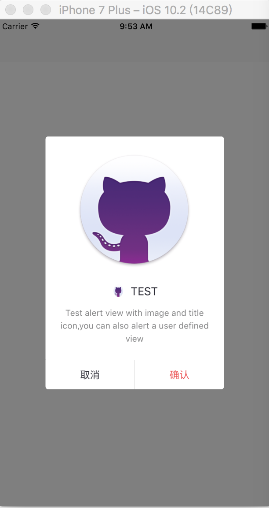

# CustomAlertView
------------
[TOC]
## 功能介绍
 1. 仿照iOS系统原生的UIAlertView定了了HCAlertView；使用起来跟系统的调用类似。
 2. 支持设置alertView的一个图像，title的图标，title，message，button的文字颜色、字体属性
 3. 实现键盘弹出，alertView自动根据位置上移，以达到是textField能够展示出来
 4. 支持自己定义一个customView

------------------
## 如何使用
* 将HCAlertView.h,HCAlertView.m导入你的工程中即可
* 使用代码示例：

``` swift
- (void)showAlert
{
    NSString *message = @"Test alert view with image and title icon,you can also alert a user defined view";
    HCAlertView *alert = [[HCAlertView alloc] initWithImage:[UIImage imageNamed:@"git"]
                                                      title:@"TEST"
                                                  titleIcon:[UIImage imageNamed:@"git"]
                                                    message:message
                                          cancelButtonTitle:@"取消"
                                          otherButtonTitles:@"确认", nil];
    [alert show];
    alert.buttonAction = ^(NSInteger selectedIndex){
        NSLog(@"%ld",selectedIndex);
    };
}
```
* 运行效果图




